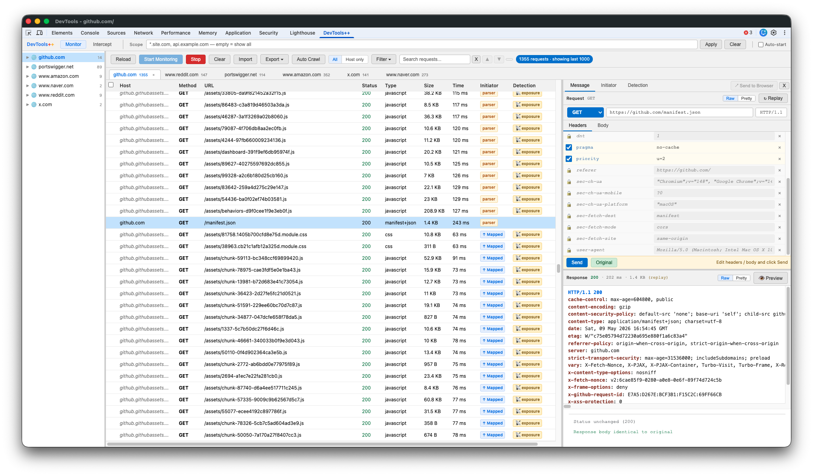
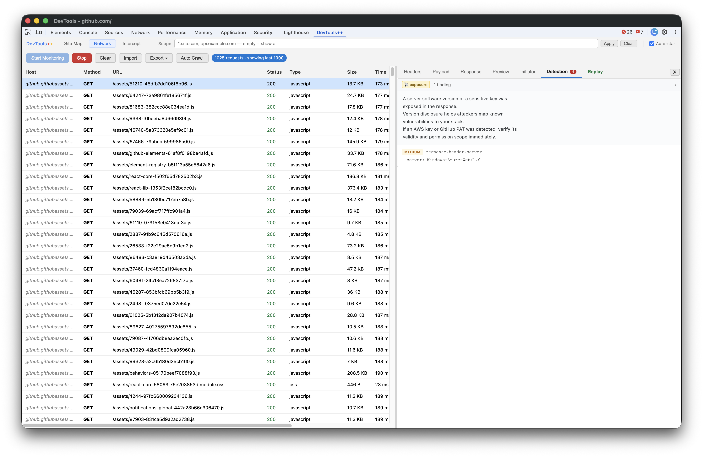
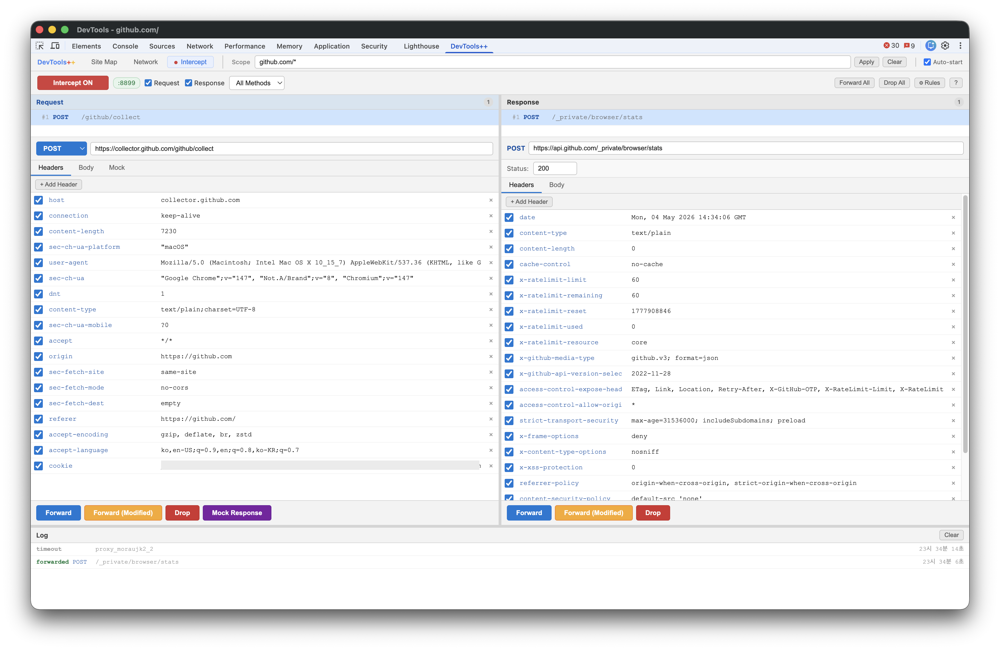
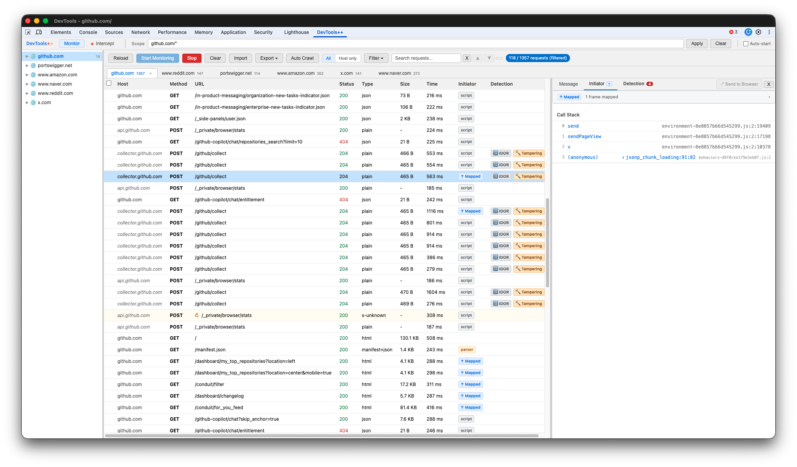

# DevTools++

> Chrome DevTools에 내장된 경량 웹/API 분석 도구 — 별도 프록시 없이, 컨텍스트 전환 없이, DevTools를 열면 바로 시작합니다.

[](#)
[](#)
[](#)

---

## DevTools++란

보안팀, 개발팀, 운영팀 — 역할에 상관없이 누구나 별도 도구 없이 브라우저 트래픽의 가시성을 확보하고, 분석하고, 테스트할 수 있습니다.

Chrome DevTools는 이미 강력한 도구입니다. 하지만 보안 분석이나 API 테스트 관점에서는 워크플로우가 불편하고 복잡한 부분이 많습니다. DevTools++는 그 핵심 기능을 더 편리하게 꺼내 씁니다.

DevTools++는 Chrome DevTools의 native함과 전문 테스트 도구의 핵심 기능을 합친 경량 web/API 테스트 도구입니다.

```
기본 DevTools  →  DevTools++  →  Burp Suite / Postman
   (메모장)        (메모장++)         (전문 IDE)
```

---

## 스크린샷

**Monitor** — 좌측 글로벌 호스트 트리, 요청 목록 상단의 호스트별 세션 탭, Message 상세 탭의 raw HTTP 렌더링 (헤더 컬러링).


**Replay** — 요청 패널의 KV 에디터(Method / URL / HTTP 버전 + Headers / Body 탭), forbidden 헤더 잠금, 원본 응답과의 JSON diff.


**Detection** — 자동 보안 패턴 플래깅과 카테고리별 다음 테스트 가이드.


**Intercept** — 요청/응답 패널의 raw HTTP 컬러링, 헤더 클릭으로만 활성화, Forward 시 양방향 포커스 자동 전환.


**Initiator** — 소스맵 디코딩된 콜스택과 민감 패턴 강조 (인증 / 토큰 / 결제 / ...).


---

## 주요 기능

### 📡 Monitor

브라우저 트래픽 캡처 / 탐색 / 개별 요청 분석을 한 곳에서 처리하는 통합 워크스페이스입니다. 이전 버전의 Network 탭과 Site Map 탭이 여기로 합쳐졌습니다.

- **글로벌 호스트 트리** (좌측 패널) — 캡처된 모든 호스트를 경로 트리로 표시, gutter 드래그로 크기 조절. **Monitor와 Intercept 양쪽 탭에서 동일하게 표시**. 노드 클릭 시 우측 요청 목록의 해당 엔드포인트로 이동.
- **세션별 탭** (요청 목록 상단) — 방문하는 메인 호스트마다 탭이 생성됩니다. 탭은 **세션** 단위로 분리됩니다: github.com 탭은 github.com 직접 요청 + 그 동안 캡처된 외부 자원(CDN, .map 파일, 광고/분석)을 함께 보여줍니다 — 페이지가 실제로 로드한 모든 트래픽 가시화. 탭은 네비게이션을 거쳐도 유지되고, 동일 호스트 재방문 시 기존 탭 재사용.
- **All / Host only 토글** — 탭마다 segmented 컨트롤. 기본 `All` (그 세션 전체). 외부 호스트 노이즈를 빼고 동일-host 직접 요청만 보고 싶을 때 `Host only`로 전환.
- **Set Scope** 드롭다운 — 트리의 호스트 행에 hover 시 표시. Exact (`host/*`) / Wildcard (`*.parent.com/*`) 중 선택해 글로벌 Scope를 한 번에 적용 (수동 입력 불필요).
- **Append-only 요청 테이블** — 페이지당 200개 이상의 요청이 발생하는 사이트에 최적화 (rAF 배치 처리, 바디 로드 큐, 최대 1,000행 표시 / 전체 히스토리 유지).
- **컬럼**: Host / Method / URL / Status / Type / Size / Time / Initiator / Detection
- **상세 패널** (우측) — 행 클릭 시 3개 탭으로 표시:
  - **Message** — Request와 Response를 상하로 배치, on-the-wire raw HTTP 형식. **실제 wire 프로토콜 버전 반영** (HTTP/1.1 vs HTTP/2 — h2 pseudo-header(`:authority` 등) 자동 감지해 request line에 정직하게 표기). 헤더명 컬러 강조, Raw / Pretty 토글. **Replay**는 요청 패널 버튼 (아래 참조). **Preview**는 응답 패널 버튼 (HTML iframe / 이미지 / JSON 트리).
  - **Initiator** — HAR `_initiator` 콜스택 + 민감 패턴 플래깅 + 소스맵 디코딩.
  - **Detection** — 해당 요청의 보안 패턴 finding.
- **Send to Browser** — 캡처한 요청을 새 탭에서 재발사. 응답이 실제 렌더링되면서 navigation은 Intercept 큐에 잡힙니다. HTTP/2 캡처도 안전하게 처리 (pseudo-header 자동 제거 후 forward).
- **Auto Crawl** — URL 목록을 임포트해 자동 순차 방문하면서 트래픽 전체 캡처.
- **Replay 발생 요청** — Send 클릭 후 매칭되는 캡처는 요청 목록에 노란색 + ↻ 배지로 표시되어, 라이브 캡처와 즉시 구분 가능.
- **Auto-start** 옵션 — DevTools 열릴 때 자동으로 모니터링 시작.
- **요청 검색** — 캡처된 요청의 URL / 헤더 / body / Detection 결과까지 검색, prev / next 네비게이션.

### 🔍 Detection

캡처된 요청과 응답을 자동으로 분석해 보안 관련 패턴을 감지합니다. 모든 finding은 **확정된 취약점이 아니라 테스트 포인트**입니다 — Replay로 직접 검증하세요.

**응답(Response) 분석**

| 배지 | 카테고리 | 심각도 | 감지 내용 |
|---|---|---|---|
| 🔑 | token | HIGH | 응답 본문에 JWT 또는 API 키 노출 |
| 🔴 | sensitive | HIGH | 응답 또는 요청 본문에 비밀번호/시크릿 필드 |
| 👤 | pii | MEDIUM | 응답에 이메일 주소 또는 전화번호 |
| ⚠️ | leak | MEDIUM | 내부 IP (프라이빗 대역만), 스택 트레이스, 서버 경로 |
| 📡 | exposure | MEDIUM/HIGH | 서버 버전 헤더, AWS 키, GitHub PAT |

**요청(Request) 분석**

| 배지 | 카테고리 | 심각도 | 감지 내용 |
|---|---|---|---|
| 🔢 | idor | INFO | 직접 객체 참조가 가능한 ID 파라미터 |
| ⚠️ | privilege | HIGH | 요청에 role / admin / permission 파라미터 |
| 🔐 | session | MEDIUM | 요청 파라미터로 전달되는 세션 토큰 |
| 🔨 | tampering | MEDIUM | 서버 로직에 영향을 줄 수 있는 파라미터 (SQL, 경로, SSRF, 명령어, 디버그) |
| 🔍 | check | INFO | 본문이 예상보다 큰 401/403 응답 |

각 Detection finding은 다음 테스트 방향을 안내하는 가이드 문구를 포함합니다.

### 🔓 Auto Decode Layer

요청/응답 헤더와 본문 어디에서든 인코딩된 값을 자동으로 감지하고 디코딩합니다 — Message 탭 하단에 접을 수 있는 **🔍 Decoded** 섹션으로 표시됩니다.

- **JWT** — 헤더와 페이로드를 인라인 디코딩, `alg: none` 및 만료 토큰 경고
- **Base64** — 디코딩 후 JSON이면 pretty-print
- **URL-encoded** — 디코딩된 원문 표시
- **중첩 JSON** — 문자열 안에 JSON이 있으면 자동 파싱
- **Unix 타임스탬프** — 사람이 읽기 쉬운 ISO 날짜로 변환

### 🔁 Replay & Tamper

캡처한 요청을 선택해 무엇이든 수정 후 즉시 재전송합니다 — Message 탭 안에서 그대로 처리됩니다.

- 요청 패널의 `↻ Replay` 버튼 한 번으로 raw HTTP view → KV 에디터 전환: Method 드롭다운 · URL · HTTP version · Headers 탭(체크박스 + name + value 행) · Body 탭.
- **Forbidden 헤더 자동 잠금** — `Cookie`, `User-Agent`, `Origin`, `Referer`, `Sec-*`, `Proxy-*`, `Access-Control-*` 등 페이지 컨텍스트 fetch가 silently drop하는 헤더는 시각적으로 잠김(🔒) 표시 + 값 편집 불가. wire에 안 나가는 값을 편집하느라 시간 낭비 안 함. 이름을 non-forbidden으로 바꾸면 잠금 해제.
- **POST body Form 뷰** — `application/x-www-form-urlencoded` 페이로드를 KV 행 형태로 표시 (체크박스 + name + value), 네이티브 DevTools의 Payload 탭과 동일. Form ↔ Raw 토글로 양방향 변환. JSON / multipart 등은 raw 텍스트 유지.
- **HTTP version 필드 편집 가능** — 보안 테스트 시나리오용 (실제 wire는 fetch가 항상 HTTP/1.1로 송신).
- **Original / Modified** 상태 버튼으로 원본 복원.
- 응답은 `(replay)` 태그와 함께 응답 패널에 표시.
- **자동 JSON diff** — 원본 응답과의 차이를 트리 형태로.
- **CORS 자동 폴백** — 페이지 컨텍스트 fetch가 실패하면 (보통 cross-origin 자원의 `Access-Control-Allow-Origin` 누락) 자동으로 Service Worker fetch로 재시도 (`<all_urls>` host_permissions, 페이지 CORS 게이트 우회). 폴백 사용 시 토스트로 안내.

### 🔎 Initiator

각 요청이 무엇에 의해 발생했는지 보여주고, 소스맵이 있으면 원본 소스코드까지 역추적합니다.

- 요청 테이블에 **script** / **parser** / **↑ Mapped** 타입 표시 — `↑ Mapped`는 캡처 시점에 **선제적으로** 매핑 시도하므로 사용자가 행을 클릭하지 않아도 컬럼에 최종 상태가 반영됨.
- Initiator 셀 클릭 시 Initiator 탭으로 바로 이동.
- **소스맵 디코딩** — 번들된 콜스택 프레임을 원본 파일명과 라인으로 역추적 (예: `bundle.js:1:12345` → `Auth.tsx:42:5`).
- **민감 패턴 감지** — 인증, 토큰, 자격증명, 결제 등 보안 관련 함수명이 있는 콜스택 프레임 강조.

### 📦 Import / Export

캡처한 모든 요청과 응답을 JSON 파일로 저장하고, 언제든 다시 불러올 수 있습니다.

- **Full Export** — 요청/응답 헤더, 바디, Detection 결과, Initiator 콜스택, 세션 attribution까지 전체 트랜잭션을 JSON으로 저장.
- **두 범위 × 두 선택**: `Current tab` 또는 `All tabs`, 각각 `Full requests` 또는 `Selected requests` (행 체크박스로 선택한 것만).
- **Import** — 저장된 JSON을 불러와 DevTools++ 안에서 그대로 재분석. 세션 단위 탭 attribution도 보존되어 (legacy export는 URL host로 폴백) 탭 strip이 자동 재구성됨.
- **AI 분석 연동** — Export한 JSON을 ChatGPT, Claude 등 AI에게 그대로 전달해 취약점 패턴 분석, 요약 보고서 생성, 특정 API 흐름 설명 요청 가능.

### 🔀 Intercept (Proxy Mode)

요청이 서버로 전달되기 **전**, 응답이 브라우저에 도달하기 **전** — 양방향으로 잡아서 수정하거나 차단합니다.

> ⚠️ **Proxy Mode는 별도 설치가 필요합니다.** 번거롭지 않습니다. 단 한 번의 최초 설치만으로 이후부터는 native DevTools 기능처럼 사용할 수 있습니다. [설치 방법 바로가기](#proxy-mode-설치)

- **프록시 자동 설정** — Proxy Mode 활성화 시 `:8899` 프록시 설정이 자동으로 적용됩니다 (FoxyProxy / 시스템 프록시 설정 불필요).
- **탭 스코프** — DevTools가 연결된 탭의 요청만 인터셉트. 다른 탭 / Service Worker / Chrome 백그라운드 트래픽은 영향 없이 정상 통과.
- **컬러 syntax 적용 raw HTTP 에디터** — Monitor의 Message 탭과 동일한 시각적 언어: request/status line은 파랑, 헤더명은 red-bold, body는 그대로. 입력 시 colored render 위에서 실시간 편집.
- **Raw / Pretty body 토글** — JSON body는 그 자리에서 pretty-print, 헤더는 그대로 유지.
- **요청 / 응답 결정** — 요청 측 Forward · Forward Modified · Drop · Mock Response, 응답 측 Forward · Forward Modified · Drop. Forward Modified는 편집된 raw HTTP를 파싱해 변조된 페이로드로 forward.
- **Mock Response를 raw HTTP로** — `HTTP/1.1 200 OK` + 헤더 + body 전체를 한 에디터에서 작성.
- **헤더 클릭으로만 사이드 활성화** — body textarea 클릭은 활성 사이드 전환에 영향 없음. 다음 `F`/`G`/`D`/`R` 단축키가 에디터에 잘못 입력되는 일 방지.
- **Forward 시 양방향 자동 포커스** — 요청 사이드에서 `F` 후 응답 도착 시 응답 사이드 자동 활성화, 응답 사이드에서 `F` 후 요청이 큐에 있으면 다시 요청 사이드 활성화. 사용자는 `F`만 연타해도 request → response → 다음 request 순환.
- **Captured-pair viewing** — 종료된 로그 행 클릭 시 양 패널에 해당 요청/응답을 read-only로 재표시. `🔒 Viewing captured` 배너 + `×` 버튼으로 종료. 라이브 인터셉트가 대기 중이면 로그 클릭 차단 (활성 결정과 충돌 방지).
- URL 와일드카드 / Method / 확장자 기반 자동 통과(bypass) 필터.
- 큐 / 에디터 / 로그 사이의 드래그 gutter — 콘텐츠가 늘어나도 메시지 에디터가 줄어들지 않고 각 영역 안에서 스크롤.
- 키보드 단축키: `F` Forward · `G` Forward Modified · `D` Drop · `R` Mock · `A` Forward All · `Q` Drop All.

---

## 설치

### 기본 설치

**방법 A — Chrome 웹 스토어** *(심사 중)*

**방법 B — 최신 릴리스 다운로드 (개발 환경 없는 분께 권장)**

1. [Releases](https://github.com/jsik22/devtools-pp/releases/latest)에서 `devtools-pp-vX.Y.Z.zip` 다운로드
2. 적당한 위치에 압축 해제 → `chrome-devtools-extension/` 폴더가 생성됨
3. `chrome://extensions` 열고 **개발자 모드** 활성화 (우측 상단 토글)
4. **압축 해제된 확장 프로그램 로드** 클릭 → `chrome-devtools-extension` 폴더 선택
5. 아무 `https://` 페이지 열기 → `F12` → **DevTools++** 탭 클릭

**방법 C — 저장소 clone (개발용 / 최신 커밋)**

```bash
git clone https://github.com/jsik22/devtools-pp.git
```

이후 위 3~5단계 진행. **압축 해제된 확장 프로그램 로드** 시 `devtools-pp/chrome-devtools-extension` 폴더 선택.

> **참고**: DevTools++ 패널은 `https://` 페이지가 열려있어야 표시됩니다. Chrome 시작 페이지를 `https://google.com` 등의 https 사이트로 설정해두면 DevTools를 열자마자 패널이 바로 나타납니다.

---

### Proxy Mode 설치

Intercept 기능은 로컬 Native Messaging 호스트의 일회성 설치가 필요합니다.

**요구사항**: Node.js v16 이상

**macOS / Linux**

```bash
cd chrome-devtools-extension/native-proxy
chmod +x install.sh
./install.sh <extension-id>
```

```bash
# HTTPS 인터셉트를 위한 CA 인증서 신뢰 등록

# macOS
sudo security add-trusted-cert -d -r trustRoot \
  -k /Library/Keychains/System.keychain \
  ~/.devtools-pp/ca.pem

# Linux (Debian/Ubuntu)
sudo cp ~/.devtools-pp/ca.pem /usr/local/share/ca-certificates/devtools-pp-ca.crt
sudo update-ca-certificates
```

**Windows**

```bat
cd chrome-devtools-extension\native-proxy
install.bat <extension-id>
```

```bat
certutil -addstore -user "Root" "%USERPROFILE%\.devtools-pp\ca.pem"
```

> Extension ID는 `chrome://extensions`에서 확인할 수 있습니다.

설치 후: Chrome 재시작 → DevTools++ 열기 → Intercept 탭 → **Proxy OFF** 클릭으로 시작.

**Proxy Mode가 하는 일:**
- 브라우저 트래픽을 로컬 MITM 프록시(`127.0.0.1:8899`)를 통해 라우팅
- CA 인증서는 로컬에서만 생성되며 외부로 전송되지 않음
- 소스코드에서 직접 확인: [`native-proxy/cert-generator.js`](chrome-devtools-extension/native-proxy/cert-generator.js)

> **nvm / fnm / asdf 사용자**: Node.js 버전 변경 후에는 `install.sh` (또는 `install.bat`)를 다시 실행해서 launcher가 가진 node 절대경로를 갱신하세요.

---

## 아키텍처

### chrome.debugger를 사용하지 않는 이유

Chrome은 탭당 debugger 연결을 1개만 허용합니다. DevTools가 열려있으면 내장 DevTools가 이미 슬롯을 점유하므로, DevTools 패널 확장에서 `chrome.debugger.attach()`는 **무조건 실패**합니다.

DevTools++의 모든 기능은 `chrome.debugger` 없이 구현되었습니다:

| 기능 | 구현 방식 |
|---|---|
| Network 캡처 | `chrome.devtools.network` API |
| Intercept | Native Messaging + 로컬 MITM 프록시 |
| Replay | `inspectedWindow.eval` + `fetch()` |
| 소스맵 디코딩 | VLQ base64 디코더 + `getResources()` |

### Proxy Mode 통신 흐름

```
Browser ──프록시 설정──▶ proxy-server.js (127.0.0.1:8899)
                                │
                          stdin/stdout
                          (4-byte LE 길이 prefix + JSON)
                                │
                       native-messaging-host.js
                                │
                       Chrome Native Messaging
                                │
                         background.js (Service Worker)
                                │
                       chrome.runtime.connect
                                │
                           panel.js (UI)
```

---

## 알려진 한계

| 이슈 | 상세 |
|---|---|
| 대용량 바디 | 성능을 위해 512KB 초과 시 truncate |
| Service Worker bypass | Service Worker에서 발생하는 요청은 인터셉트 불가 (FoxyProxy + Burp와 동일한 한계) |
| 소스맵 접근성 | `.map` 파일이 fetch 가능할 때만 디코딩 동작 — 프로덕션 사이트에서 map을 배포하지 않거나 CORS로 막혀 있으면 매핑 안 됨 |
| 요청 목록의 `.map` 파일 | Chrome은 source map을 내부에서 fetch하고 reload 후에도 캐시 — `.map` 파일은 cold load에서만 Monitor 목록에 나타남. 모든 자원 가시화를 원한다면 메인 DevTools의 Network 탭에서 "Disable cache" 활성화 권장 |

---

## 향후 계획

- [ ] Chrome 웹 스토어 등록
- [ ] 요청 시퀀스 체이닝 (A 응답의 토큰을 B 요청에 자동 삽입)
- [ ] 다국어 지원 — 한국어 / 영어 UI 전환

---

## 개인정보 보호

DevTools++는 어떠한 사용자 데이터도 수집하거나 전송하지 않습니다. 모든 처리는 사용자의 기기 내에서만 이루어집니다.

- 네트워크 캡처 데이터는 DevTools++ 패널 안에서만 표시되며 외부로 전송되지 않음
- Import / Export 데이터는 로컬 디스크에만 저장됨
- Detection 분석은 전적으로 로컬에서 실행됨
- Proxy Mode의 MITM 프록시는 `127.0.0.1:8899`에서만 동작하며 외부 서버로 트래픽을 전달하지 않음
- CA 인증서는 로컬에서 생성되며(`~/.devtools-pp/ca.pem`) 외부로 전송되지 않음

자세한 내용은 [PRIVACY.md](PRIVACY.md)를 참조하세요.

---

## 법적 고지

DevTools++는 **본인 소유 시스템 또는 명시적으로 허가된 시스템**에서만 사용하십시오. 허가받지 않은 시스템에 대한 사용은 관련 법령에 따라 처벌받을 수 있습니다.

---

## 라이선스

MIT License — 자세한 내용은 [LICENSE](LICENSE) 파일을 참조하세요.

### 서드파티

- **node-forge** — BSD-3-Clause 라이선스. 전체 고지는 [NOTICE](NOTICE) 파일을 참조하세요.
