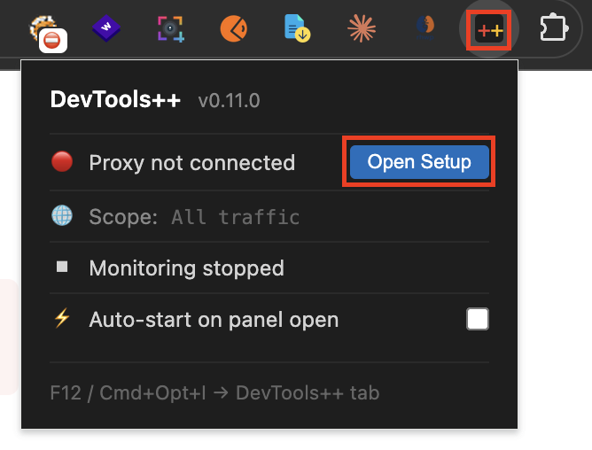
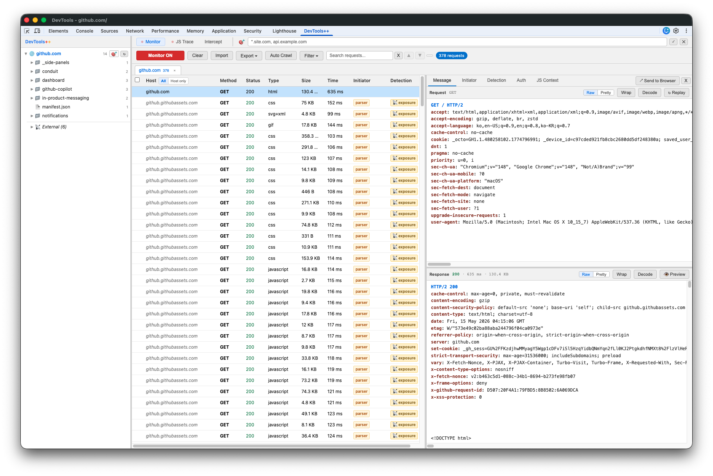
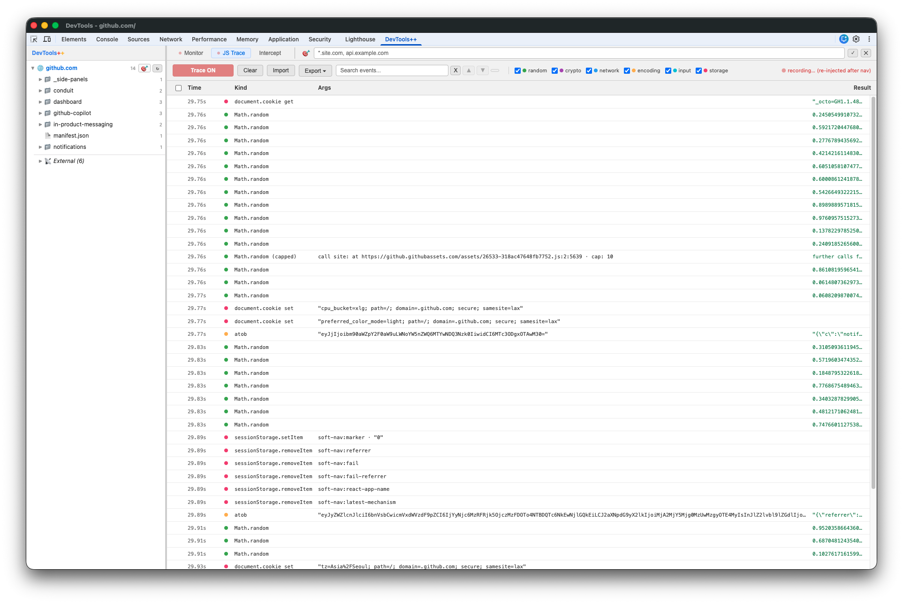
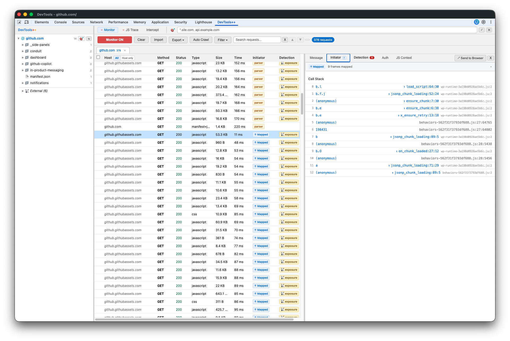
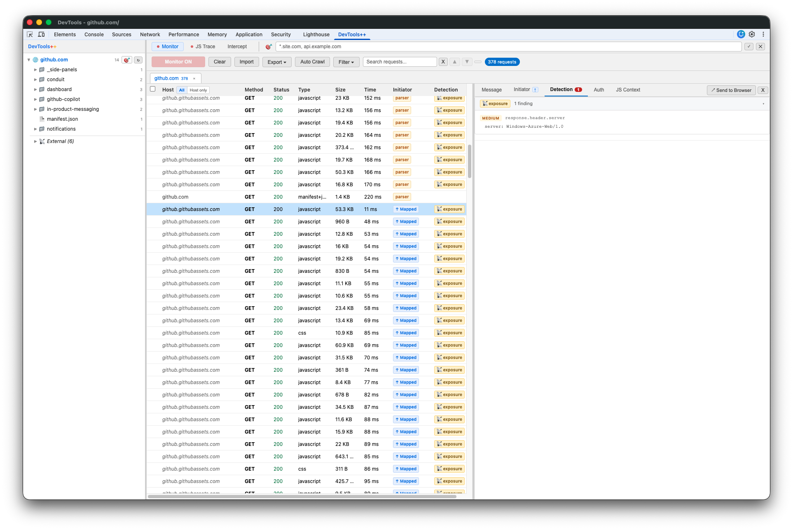
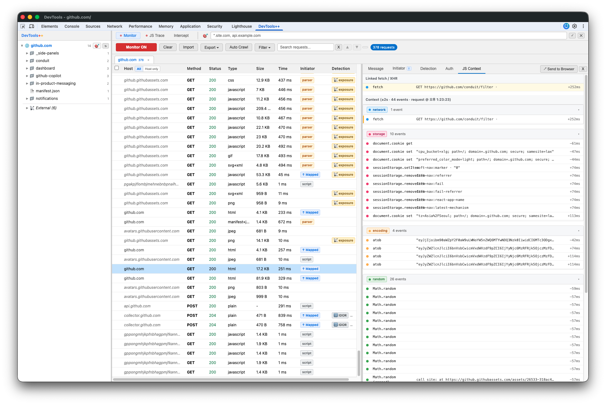
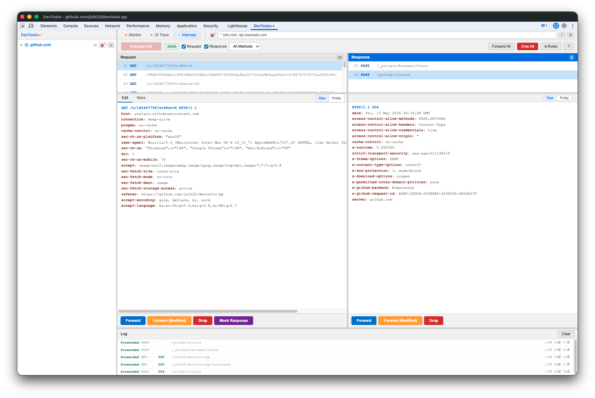

# DevTools++

> DevTools++는 Chrome DevTools의 Native함과 전문 테스트 도구(Burp, Postman 등...)의 핵심 기능을 합친 경량 Web/API 테스트 도구입니다. 패널 하나로 모니터링 · 인터셉트 · 리플레이 · JS 분석이 가능합니다.

Chrome DevTools는 이미 강력한 도구입니다. 하지만 보안 분석이나 API 테스트 관점에서는 워크플로우가 불편하고 복잡한 부분이 많습니다. DevTools++는 그 핵심 기능을 더 편리하고 직관적으로 꺼내 사용합니다.

특히 DevTools++는 웹 요청 모니터링 뿐만 아니라 웹 요청이 생성되기 전 JS 레이어에서 발생되는 인증·세션·토큰 관련 동작을 가시화하고 하나의 흐름으로 분석할 수 있게 도와줍니다.

---

## 설치

### 1. 확장 프로그램 설치 (Chrome 웹 스토어)

<a href="https://chromewebstore.google.com/detail/devtools++/hnakhjcfhlpcjmdgpjaadobiefgkaaal" target="_blank" rel="noopener noreferrer"><strong>Chrome 웹 스토어에서 DevTools++ 설치</strong></a>

설치 후 아무 `https://` 페이지에서 **F12 → DevTools++ 탭**이 보이면 완료입니다.
Intercept를 제외한 모든 기능(Monitor / JS Trace / Replay / Detection / Initiator / Auto Decode)을 바로 사용할 수 있습니다.

### 2. Intercept용 로컬 프록시 설치 (선택)

Intercept는 로컬 MITM 프록시가 필요합니다 (Node.js v16+, 최초 1회).

툴바의 **DevTools++ 아이콘**을 클릭하면 나오는 팝업에서 **`Open Setup`** 버튼을 누르세요.

셋업 화면이 프록시 내려받기 · 설치 스크립트 실행 · CA 인증서 신뢰 등록을 OS별 명령과 함께 단계별로 안내하고, 연결 상태도 실시간으로 확인해 줍니다.

개발자 / 기여자 — 압축 해제된 확장 로드

1. [Releases](https://github.com/jsik22/devtools-pp/releases/latest)에서 zip 다운로드 → 압축 해제 (또는 repo clone)
2. `chrome://extensions` → 개발자 모드 → **압축 해제된 확장 프로그램 로드** → `chrome-devtools-extension` 폴더 선택
3. native-proxy는 위와 동일하게 `Open Setup` 안내를 따르되, Extension ID는 셋업 화면이 자동 주입 (load-unpacked는 프로필별 ID)

---

## 주요 기능

### 📡 Monitor

페이지가 주고받는 모든 HTTP(S) 트래픽을 실시간으로 잡아 보여주는 작업의 중심입니다. 좌측엔 호스트 트리, 가운데엔 요청 목록, 행을 클릭하면 우측에 요청·응답을 헤더부터 본문까지 가공 없이 그대로 펼쳐 줍니다. 캡처한 요청을 새 탭에서 다시 쏘는 Send to Browser, URL 목록을 자동 순회하는 Auto Crawl, 헤더·본문·Detection 결과까지 훑는 검색도 전부 여기 있습니다. 기본 개발자도구 네트워크 목록에서는 페이지가 넘어가는 순간 보였다 사라지는 3xx 리다이렉트 응답도, 여기서는 Location 헤더까지 그대로 남아 끝까지 추적할 수 있습니다.

### 🧬 JS Trace

요청이 네트워크로 나가기 *전에* 페이지 JS가 인증·세션·토큰을 어떻게 다루는지 타임라인으로 기록합니다. `Math.random` / `crypto.*` / `fetch`·XHR / `btoa`·`atob` / `input.value` / Storage / cookie 등 11종 호출을 후킹해서, 토큰이 어디서 만들어지고 어떤 값이 요청에 실리는지 따라갈 수 있습니다. Monitor를 켜면 자동으로 같이 켜집니다.

### 🔀 Intercept

요청이 서버로 가기 전, 응답이 브라우저에 닿기 전 멈춰 세워 들여다 볼 수 있습니다. 최초 1회 native-proxy만 설치하면 이제 별도 프록시 도구를 실행하고 설정하는 과정없이 개발자도구 안에서 바로 사용할 수 있습니다.

### 🔁 Replay

모니터에 수집된 요청을 골라 Method·URL·헤더·본문을 KV 에디터에서 마음대로 바꿔 즉시 다시 보냅니다. 브라우저 정책상 변경이 허용되지 않는 헤더(Cookie·Origin·Sec-* 등)는 잠금 표시로 구분해 헛된 시도를 방지하고, 원본 응답과의 JSON diff를 자동으로 떠 줍니다. cross-origin으로 막히면 Service Worker 경로로 우회를 시도합니다.

### 🔍 Detection

캡처된 요청·응답을 자동으로 훑어 보안상 눈여겨볼 패턴에 깃발을 꽂습니다. 응답 쪽 토큰·비밀값·PII·내부정보 노출, 요청 쪽 IDOR·권한 파라미터·변조 포인트 등을 잡아 주는데, 이건 확정된 취약점이 아니라 *테스트 포인트*입니다. 카테고리마다 "다음에 뭘 시도해보라"는 안내가 붙어 Replay로 바로 검증할 수 있습니다.

### 🧭 Initiator

이 요청이 대체 무엇 때문에 발생했는지 JS 콜스택을 보여주고, 소스맵이 있으면 번들된 한 줄을 원본 파일:라인까지 거꾸로 풀어 줍니다. 인증·토큰·자격증명·결제 같은 민감한 함수명이 콜스택에 보이면 강조해 줘서, 흥미로운 코드 지점을 빠르게 찾아갈 수 있습니다.

### 📦 Import / Export

수집한 요청·응답을 헤더·본문·Detection·Initiator·JS Trace까지 통째로 JSON으로 저장하고, 언제든 다시 불러와 그대로 재분석합니다. 그 JSON을 ChatGPT·Claude 같은 AI에 그대로 던져 취약점 패턴 분석이나 흐름 설명을 맡길 수도 있습니다.

---

## 워크플로우 예시

### 예시 1 — 액세스 제어 검증 (서버 vs 클라이언트 판정 구분)

상황: 어떤 페이지가 "Access Denied" 알림을 띄울 때, 그 판정이 클라이언트 JS에 의한 것인지 서버 검증의 결과인지 식별.

1. Monitor ON → 페이지 진입 → 알림 액션 수행
2. 해당 요청 행 클릭 → Message 탭에서 응답 크기와 본문 확인
   - 응답이 작고 리다이렉트·알림 스크립트만 담겨 있으면 → 서버 단 판정. Intercept로 헤더를 조작해 응답 변화 관찰
   - 응답이 정상 크기면 → 다음 단계
3. JS Context 탭 → 별도 API 호출, 입력값 추출, 암호화 연산 등이 보이면 그게 클라이언트 측 판정 경로
4. Monitor 검색으로 의심 키워드 입력 → 요청·응답 본문에서 관련 트래픽 식별

### 예시 2 — 요청 변조로 권한 우회 시도

1. Monitor 행 클릭 → Message 탭 → ↻ Replay → KV 에디터로 전환
2. URL / 헤더 / 본문 수정. 브라우저 정책상 변경이 허용되지 않는 헤더(Cookie·Origin·Sec-* 등)는 잠금(🔒) 표시로 구분
3. Send → 응답 패널에 결과 + 원본 응답과의 JSON diff 자동 표시
4. 더 깊이 변조하려면 Intercept ON → 같은 요청 재트리거 → raw HTTP 에디터에서 자유 변조 → Forward Modified

---

## 둘러보기

**Monitor** — 좌측 호스트 트리, 요청 목록, Message 상세 탭의 raw HTTP (Request/Response).

**JS Trace** — 페이지 JS의 인증·세션·토큰 호출 timeline. 카테고리별 컬러 dot 필터.

**Initiator** — 요청 발생 콜스택 + 소스맵 디코딩 + 민감 함수명 강조.

**Detection** — 캡처된 요청/응답의 자동 보안 패턴 플래깅.

**JS Context** — Monitor 요청과 ±2초 윈도우의 JS 호출을 카테고리별로 묶어 표시 (Monitor ↔ JS Trace 브릿지).

**Intercept** — 요청/응답 양방향 hold, raw HTTP 컬러 에디터, 하단 공유 로그.

---

## 아키텍처 요약

- `chrome.debugger` 미사용 (DevTools 패널 확장에서 attach 불가) → `chrome.devtools.network` + `inspectedWindow.eval` + Native Messaging 조합
- Proxy Mode 흐름: `panel.js ⇄ background SW ⇄ Native Messaging Host ⇄ proxy-server.js (127.0.0.1:8899)`
- 버전별 변경 이력: [CHANGELOG.md](CHANGELOG.md)

---

## 개인정보 / 법적 고지

- 모든 분석은 로컬에서만. 외부 서버로 어떤 데이터도 전송되지 않음
- CA 인증서는 로컬 생성(`~/.devtools-pp/ca.pem`), 외부 전송 없음
- **본인 소유 또는 명시적으로 허가된 시스템에서만 사용하십시오.** 무단 사용은 법적 처벌 대상

[PRIVACY.md](PRIVACY.md) · [LICENSE](LICENSE) (MIT) · [NOTICE](NOTICE) (node-forge BSD-3-Clause)
