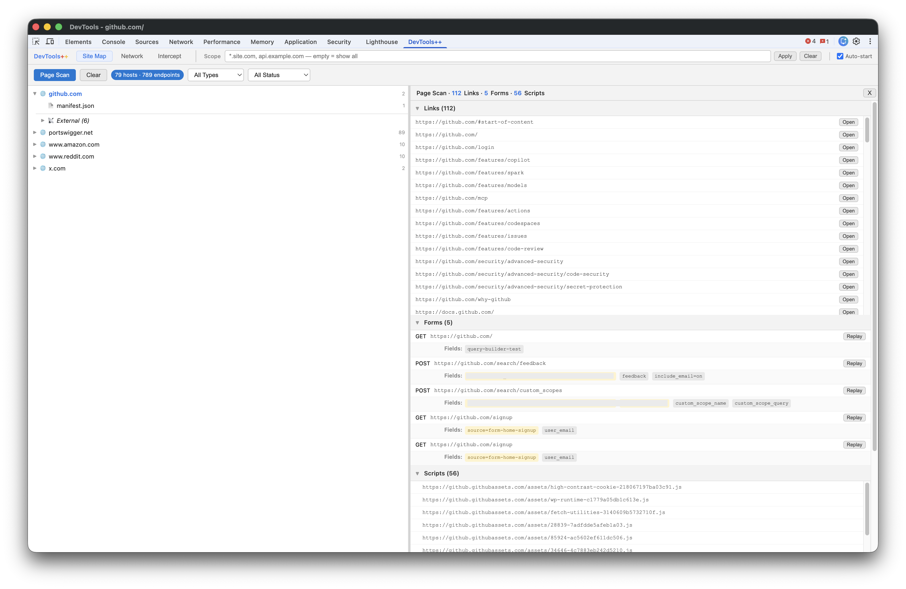
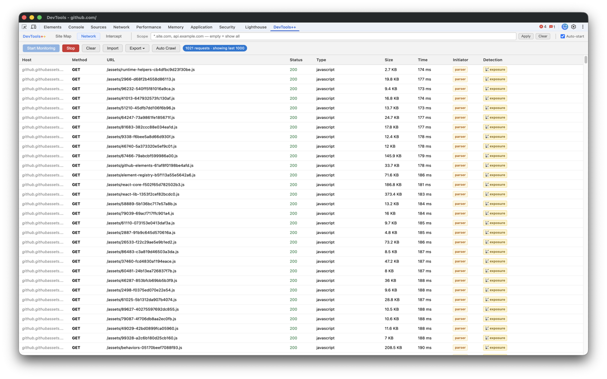
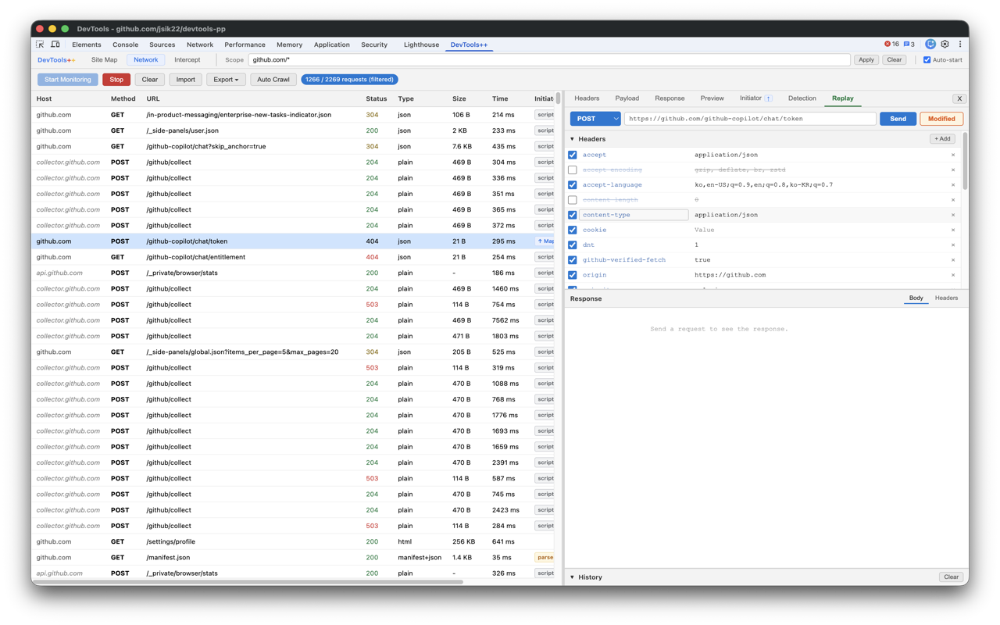
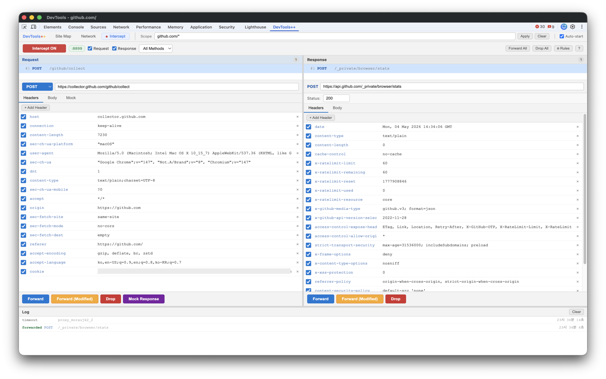

# DevTools++

> A lightweight web and API analysis tool built into Chrome DevTools — no separate proxy, no context-switching, just open DevTools and start working.

[](#)
[](#)
[](#)

---

## Why DevTools++?

Security testing tools like Burp Suite and API testing tools like Postman are powerful, but require a separate application, proxy configuration, and constant context-switching between tools. In many cases, however, only a small fraction of their features are actually needed.

DevTools++ lives inside Chrome DevTools — the tool you already have open every day.

**Install once. Always ready.**

Install once, and DevTools++ works silently alongside your browser — no separate app to launch, no proxy settings to toggle, no workflow interruption. Just open DevTools and start working.

```
Native DevTools  →  DevTools++  →  Burp Suite / Postman
  (Notepad)        (Notepad++)      (Full IDE)
```

---

## The Problem It Solves

**"Our security team sent a pentest report. We need to verify the fixes ourselves."**

Security pentest reports are typically produced using Burp Suite — request interception, parameter tampering, response analysis. Development and operations teams want to reproduce and verify the same findings after applying fixes, but the reality is:

> *"Do we really need to install and learn Burp Suite just for this?"*

Burp is powerful but comes with a steep learning curve: installation, proxy configuration, certificate setup, and an entirely new tool to master. For teams where security isn't the primary role, the barrier is too high.

DevTools++ bridges this gap. Everything your security team did in Burp — intercepting requests, modifying parameters, analyzing responses — can be done by developers and ops teams directly inside Chrome, with no additional tools required.

| Security Team (Burp) | Dev/Ops Team (DevTools++) |
|---|---|
| Intercept requests via Proxy | Hold requests in the Intercept tab |
| Tamper parameters in Repeater | Edit and resend in the Replay tab |
| Analyze response codes and body | Review in the Network / Replay panel |
| Map endpoints in Target → Site Map | Endpoints auto-collected in Site Map tab |

---

## Screenshots

**Site Map + Page Scan** — passive endpoint tree, plus DOM-extracted links / forms / scripts on the right.


**Network monitoring** — append-only table tuned for high-volume sites, with Initiator and Detection columns.


**Detection** — automatic security-pattern flagging on every captured request and response.


**Replay & Tamper** — edit and resend any captured request; the Modified badge tracks divergence from the original.


**Intercept** — request and response dual panel for hold / modify / mock workflows.


---

## Features

### 🗺 Site Map

Passively collects network requests and visualizes them as a **domain → path → endpoint** tree. Just use the page — the API structure builds itself.

- **Page Scan**: Extracts links (`<a>`), forms (`<form>`), and scripts (`<script>`) from the current page DOM
- **Set Scope** (global): Define a capture scope by host/path and instantly filter already-collected data as well
- Host-level External grouping — each main host has its own External subtree
- Click any node to see its request list and details on the right panel

### 📡 Network Monitoring

Captures all completed requests without `chrome.debugger`. Works the moment DevTools is open.

- Append-only table tuned for sites that fire 200+ requests per page (rAF batching, body-load queue, 1,000-row display cap with full history retained)
- **Columns**: Host / Method / URL / Status / Type / Size / Time / Initiator / Detection
- **Detail tabs**: Headers / Payload / Response / Preview / Initiator / Detection / Replay
- **Auto Crawl**: Import a URL list and automatically visit each page, capturing all network traffic
- **Auto Decode**: Inline JWT, Base64, URL-encoded, nested JSON, and Unix timestamp detection in headers, payload, and response (size-capped)
- **Initiator**: Call-stack from HAR `_initiator`, sensitive-pattern flagging (auth, token, crypto, payment, ...), and source-map decoding for bundled / minified scripts
- Import / Export: Detection-only or full requests (JSON)
- Auto-start option: monitoring begins automatically when DevTools opens

### 🔍 Detection

Automatically analyzes captured requests and responses for security-relevant patterns. Every finding is a **test point**, not a confirmed vulnerability — use Replay to verify.

**Response Analysis**

| Badge | Category | Severity | What it detects |
|---|---|---|---|
| 🔑 | token | HIGH | JWT or API key exposed in response body |
| 🔴 | sensitive | HIGH | Password / secret fields in response or request body |
| 👤 | pii | MEDIUM | Email addresses or phone numbers in response |
| ⚠️ | leak | MEDIUM | Internal IPs, stack traces, server paths |
| 📡 | exposure | MEDIUM/HIGH | Server version headers, AWS keys, GitHub PATs |

**Request Analysis**

| Badge | Category | Severity | What it detects |
|---|---|---|---|
| 🔢 | idor | INFO | ID parameters that may allow direct object reference |
| ⚠️ | privilege | HIGH | Role / admin / permission parameters in requests |
| 🔐 | session | MEDIUM | Session tokens passed as request parameters |
| 🔨 | tampering | MEDIUM | Parameters that may influence server-side logic (SQL, path, SSRF, command, debug) |
| 🔍 | check | INFO | 401/403 responses with unexpectedly large bodies |

Each Detection finding includes a contextual guide explaining what to test next.

### 🔓 Auto Decode Layer

Automatically detects and decodes encoded values anywhere in request/response headers and bodies.

- **JWT**: Decodes header and payload inline, warns on `alg: none` and expired tokens
- **Base64**: Decodes and pretty-prints JSON if applicable
- **URL-encoded**: Shows decoded form
- **Nested JSON**: Parses stringified JSON values
- **Unix timestamps**: Converts to human-readable ISO dates

Displayed as a collapsible **🔍 Decoded** section at the bottom of Headers, Payload, and Response tabs.

### 🔁 Replay & Tamper

Capture a request, edit anything, and resend — without leaving DevTools.

- Edit Method / URL / Headers / Query Params / Body
- JSON / Form / Raw body support
- Automatic JSON diff against original response
- Last 50 replay history preserved

### 📦 Import / Export

Save all captured requests and responses as a JSON file and reload them at any time.

- **Full Export**: Saves the complete transaction — request/response headers, body, Detection results, and Initiator call stack — as a single JSON file
- **Detection Export**: Extracts Detection findings only, for a lightweight report
- **Import**: Load a previously exported JSON back into DevTools++ for re-analysis — reproduce test sessions, share data with teammates, or revisit findings later
- **AI-assisted analysis**: Hand the exported JSON directly to an AI assistant (ChatGPT, Claude, etc.) to identify vulnerability patterns, generate summary reports, or explain specific API flows
- Full session history is preserved on disk even after monitoring ends — reopen and continue analysis anytime

### 🔎 Initiator

Shows what triggered each request — and traces it back to original source code when source maps are available.

- **script** / **parser** / **↑ Mapped** type indicators in the Network table
- Click an Initiator cell in the Network table to jump directly to the Initiator detail tab
- **Source map decoding**: Maps minified call stack frames back to original file and line number (e.g., `bundle.js:1:12345` → `Auth.tsx:42:5`)
- **Sensitive pattern detection**: Highlights call stack frames containing authentication, token, credential, payment, and other security-relevant function names

### 🔀 Intercept (Proxy Mode)

Intercept requests **before** they reach the server and responses **before** they reach the browser.

> ⚠️ **Proxy Mode requires a one-time native setup.** It's not as complicated as it sounds — a single install is all it takes. After that, it works just like any native DevTools feature. [See installation below.](#proxy-mode-setup)

- **Automatic proxy configuration**: Enabling Proxy Mode automatically activates the `:8899` proxy setting — no need for separate proxy extensions like FoxyProxy or manual system proxy configuration
- **Tab-scoped**: Only the DevTools-attached tab's requests are intercepted — other tabs, Service Workers, and Chrome's own background traffic pass through untouched
- **Request intercept**: Forward / Forward Modified / Drop / Mock Response
- **Response intercept**: Review and modify server responses before the browser receives them
- **Mock Response**: Return a custom response without hitting the server
- URL wildcard / Method / extension-based bypass filters
- Keyboard shortcuts: `F` Forward · `G` Forward Modified · `D` Drop · `R` Mock · `A` Forward All · `Q` Drop All

---

## Installation

### Basic Installation

**Option A — Chrome Web Store** *(under review)*

**Option B — Latest release (recommended for non-developers)**

1. Go to [Releases](https://github.com/jsik22/devtools-pp/releases/latest) and download `devtools-pp-vX.Y.Z.zip`
2. Unzip it anywhere on your machine — this gives you a `chrome-devtools-extension/` folder
3. Open `chrome://extensions` → enable **Developer mode** (top right toggle)
4. Click **Load unpacked** → select the `chrome-devtools-extension` folder
5. Open any `https://` page → press `F12` → click the **DevTools++** tab

**Option C — Clone the repository (for development / latest commit)**

```bash
git clone https://github.com/jsik22/devtools-pp.git
```

Then follow steps 3–5 above, pointing **Load unpacked** at `devtools-pp/chrome-devtools-extension`.

> **Note**: DevTools++ panel requires an `https://` page to be open. Set your Chrome startup page to an `https://` site such as `https://google.com` to ensure the panel loads immediately on DevTools open.

---

### Proxy Mode Setup

Intercept requires a one-time installation of a local Native Messaging host.

**Requirements**: Node.js v16+

**macOS / Linux**

```bash
cd chrome-devtools-extension/native-proxy
chmod +x install.sh
./install.sh <extension-id>
```

```bash
# Trust the CA certificate for HTTPS interception

# macOS
sudo security add-trusted-cert -d -r trustRoot \
  -k /Library/Keychains/System.keychain \
  ~/.devtools-pp/ca.pem

# Linux (Debian/Ubuntu)
sudo cp ~/.devtools-pp/ca.pem /usr/local/share/ca-certificates/devtools-pp-ca.crt
sudo update-ca-certificates
```

**Windows**

```bat
cd chrome-devtools-extension\native-proxy
install.bat <extension-id>
```

```bat
certutil -addstore -user "Root" "%USERPROFILE%\.devtools-pp\ca.pem"
```

> Find your Extension ID at `chrome://extensions`

After installation: Restart Chrome → Open DevTools++ → Intercept tab → click **Proxy OFF** to start.

**What Proxy Mode does:**
- Routes browser traffic through a local MITM proxy at `127.0.0.1:8899`
- CA certificate is generated locally and never transmitted externally
- Verify the source: [`native-proxy/cert-generator.js`](chrome-devtools-extension/native-proxy/cert-generator.js)

> **nvm / fnm / asdf users**: After switching Node.js versions, rerun `install.sh` (or `install.bat`) to refresh the launcher's hard-coded node path.

---

## Architecture

### Why not chrome.debugger?

Chrome allows only one debugger connection per tab. Since the built-in DevTools already occupies that slot, `chrome.debugger.attach()` from a DevTools panel extension **always fails**.

Every feature in DevTools++ is implemented without `chrome.debugger`:

| Feature | Implementation |
|---|---|
| Network monitoring | `chrome.devtools.network` API |
| Intercept | Native Messaging + local MITM proxy |
| Replay | `fetch()` via `inspectedWindow.eval` |
| Source map decoding | VLQ base64 decoder + `getResources()` |

### Proxy Mode Communication

```
Browser ──proxy settings──▶ proxy-server.js (127.0.0.1:8899)
                                    │
                              stdin/stdout
                              (4-byte LE length prefix + JSON)
                                    │
                           native-messaging-host.js
                                    │
                           Chrome Native Messaging
                                    │
                             background.js (Service Worker)
                                    │
                           chrome.runtime.connect
                                    │
                               panel.js (UI)
```

---

## Known Limitations

| Issue | Details |
|---|---|
| Large bodies | Bodies over 512KB are truncated for performance |
| Service Worker bypass | Requests from Service Workers and Shared Workers are not intercepted (same limitation as FoxyProxy + Burp) |
| Source map availability | Source map decoding only works when the `.map` file can be fetched from the inspected page |

---

## Roadmap

- [ ] Chrome Web Store release
- [ ] Request sequence chaining
- [ ] Multilingual support — Korean / English UI toggle

---

## Privacy

DevTools++ does not collect, transmit, or share any user data. All processing happens locally on your device.

- Captured network data is displayed within the DevTools++ panel only and never leaves your device
- Import / Export data is saved to your local disk only
- All Detection analysis runs locally within the extension
- The Proxy Mode MITM proxy runs at `127.0.0.1:8899` and does not relay traffic to any external server
- The CA certificate is generated locally (`~/.devtools-pp/ca.pem`) and never transmitted externally

See [PRIVACY.md](PRIVACY.md) for full details.

---

## Legal Notice

DevTools++ is intended for use on systems you own or have **explicit written permission** to test. Unauthorized use against third-party systems may violate applicable laws.

---

## License

MIT License — see [LICENSE](LICENSE) for details.

### Third-party

- **node-forge** — BSD-3-Clause license. See [NOTICE](NOTICE) for full attribution.
